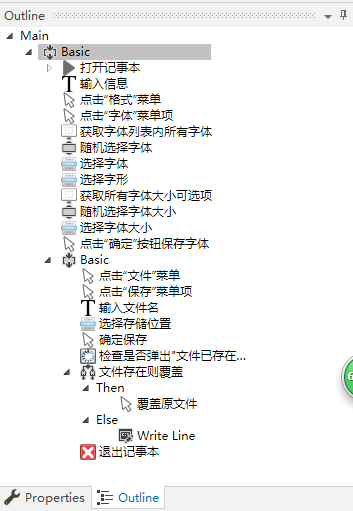

### UiPath实践之记事本自动化
以学习目的，利用UiPath对RPA做的一次实践练习。
该项目流程是打开记事本，输入一段文字，然后随机调整字体和字体大小，然后保存文件，判断文件是否重复，重复则覆盖,最后关闭记事本程序。
其中随机调整字体和字体大小的实现尝试采用了自定义Activity，以达到重用的目的，它的功能是传入一个字符串FullText，指定一个
Sparator分隔符分割，然后随机选择其中一个字符串返回。详细记录[请看这里](https://segmentfault.com/a/1190000017440647 "自定义Activity"),项目源文件在[这里](https://github.com/ilinxiao/rpa_test/tree/master/SelectRandomItem)

### OUTLINE

### 总结
对UiPath如何定位元素有了比较清楚的理解，对此写了[一篇短文](https://segmentfault.com/a/1190000017416642)做了分析。元素Selector通过XML标签来表示，
其中主要应用到的属性是app、cls、title、ctrlid。对RPA整个流程设计有了初步认识，可以这么说，RPA是站在了一个不同于直接跟机器打交道的角度来思考如何提高效率。
